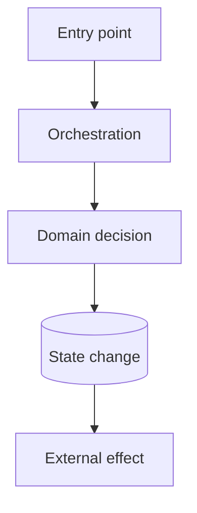

# Mental Model Output Template

Use the smallest applicable subset. Layer 0, a concise Layer 1, evidence, confidence, coverage, and Layer 3 are required unless the user asks for a focused partial output. Omit irrelevant Layer 2 sections. Write the following YAML as document frontmatter without the surrounding code fence.

```yaml
---
title: "<Mental model title>"
source_type: "RFC | PR | code-change | system"
source_reference: "<path, PR number, URL, branch, or question>"
generated_at: "<ISO timestamp when available>"
analysis_confidence: "<0.00-1.00>"
analysis_status: "complete | bounded | provisional"
---
```

# Mental Model: `<Subject>`

> **Status:** `<Complete, bounded, or provisional>`
>
> **Overall confidence:** `<0.00-1.00>`
>
> **Scope:** `<What was and was not analysed>`

## Layer 0 — Meeting Card

Keep this to one ordinary screen: roughly 120 words, no introductory prose, and at most seven labelled items.

**Problem:**

`<One sentence>`

**Impact:**

`<Why this matters>`

**Goal:**

`<Desired capability or behaviour>`

**Non-goals:**

`<What is intentionally excluded>`

**Approach:**

`<One or two sentences>`

**Boundaries:**

`<Major epic, component, or change boundaries>`

**Primary risk / decision needed:**

`<Most important risk, unknown, or decision>`

## Layer 1 — Working Mental Model

Keep this layer reviewable in about five minutes.

### 1. Purpose and scope

Answer what this is, why it exists, who or what uses it, and what is outside scope.

### 2. Main flow

Include one diagram only when a flow exists. Adapt it to real source concepts.



Explain the flow in no more than seven numbered steps.

### 3. State and invariants

| State / invariant | Owner or enforcement point | Evidence | Confidence |
|---|---|---|---|
| `<State or source-backed invariant>` | `<Owner>` | `<Source>` | `<Fact / inference and score>` |

Identify the source of truth, mutable state, enforced guarantees, and consistency assumptions. Never invent invariants.

### 4. Key decisions and trade-offs

| Decision | Why | Pros | Cons | Evidence / status |
|---|---|---|---|---|
| `<Meaningful decision>` | `<Reason>` | `<Benefit>` | `<Cost>` | `<Accepted / proposed / inferred / unresolved plus source>` |

### 5. Failure model

| Failure | Effect | Detection | Recovery or mitigation | Confidence |
|---|---|---|---|---|
| `<Supported failure>` | `<Impact>` | `<Signal>` | `<Retry, recovery, or unknown>` | `<Score>` |

Cover applicable retry, duplication, ordering, and user/business impact without inventing failures.

### 6. Verification model

State what proves the main behaviour, existing and missing tests, relevant runtime signals, and rollout success criteria.

### 7. Unknowns and decisions

| Unknown or decision | Why it matters | How to resolve it | Blocking? |
|---|---|---|---|
| `<Unknown or required choice>` | `<Consequence>` | `<Needed evidence or owner>` | `<Yes / no>` |

## Layer 2 — Deep Reference

Avoid repeating Layer 1. Wrap substantial sections in:

```html
<details>
<summary>Open detailed section</summary>

Detailed content.

</details>
```

### A. Evidence map

| Claim | Evidence | Type |
|---|---|---|
| `<Important claim>` | `<file:line, test, RFC section, PR/commit, migration, or observed command>` | `<Fact / inference / unknown>` |

### B. Component and ownership map

| Component | Responsibility | Input | Output | State touched |
|---|---|---|---|---|
| `<Component>` | `<Responsibility>` | `<Input>` | `<Output>` | `<State>` |

### C. Detailed execution paths

For each important path, identify trigger, preconditions, ordered steps, transaction boundaries, mutations, external calls, emitted events, errors, and retries. Add a `sequenceDiagram` only when ordering or interaction matters.

### D. Data and persistence model

When relevant, cover entities and relationships, schema changes, indexes and constraints, transactions, locking/concurrency, migrations, compatibility, cleanup, and retention.

### E. API, event, and contract model

When relevant, cover inputs, outputs, versioning, compatibility, validation, ownership, consumers, and error semantics.

### F. Async and concurrency model

When relevant, cover scheduler/queue, delivery guarantee, acknowledgement, ordering, retries, idempotency, races, duplication, and dead letters. Write `Not established from available evidence` when necessary.

### G. Security and trust boundaries

When relevant, cover authentication, authorization, sensitive data, trust boundaries, validation, secrets, privilege changes, and abuse risk.

### H. Observability and operations

When relevant, cover logs, metrics, traces, dashboards, alerts, runbooks, failure visibility, and operational ownership.

### I. Rollout, migration, and rollback

When relevant, cover phases, flags, data migration, compatibility, rollback, irreversible steps, and success criteria.

### J. Test matrix

| Behaviour or risk | Existing evidence | Missing validation | Priority |
|---|---|---|---|
| `<Behaviour or risk>` | `<Test or observation>` | `<Gap>` | `<Priority>` |

### K. Alternatives and rejected options

Include only sourced alternatives or analysis proposals clearly marked as such.

| Alternative | Benefit | Cost or risk | Status |
|---|---|---|---|
| `<Alternative>` | `<Benefit>` | `<Cost>` | `<Accepted / rejected / proposed>` |

### L. Change map

For code changes and PRs, identify the semantic spine, before/after behaviour, mechanical/generated changes, and excluded areas.

| Change group | Files or modules | Purpose | Semantic risk | Review depth |
|---|---|---|---|---|
| `<Group>` | `<Paths>` | `<Purpose>` | `<Risk>` | `<Deep / sampled / excluded>` |

### M. Review findings

Include only in `REVIEW_MODE`; group by severity. If none are supported, say so explicitly.

#### `[Blocker | Important | Improvement | Nit] <Concise title>`

- **Evidence:** `<Precise source>`
- **Problem:** `<Defect or weakness>`
- **Consequence:** `<Concrete impact>`
- **Recommendation:** `<Action>`
- **Confidence:** `<0.00-1.00>`

### N. Domain glossary

Include only terms necessary to understand the subject.

| Term | Meaning in this system | Evidence |
|---|---|---|
| `<Term>` | `<Context-specific meaning>` | `<Source>` |

## Layer 3 — Rehearsal

### 90-second explanation

Provide a speaking outline, not an essay:

1. Problem
2. Goal
3. Main flow
4. Important state or invariant
5. Key design choice
6. Main risk
7. Verification

### Likely team questions

List five questions without exposing answers immediately.

1. `<Question>`
2. `<Question>`
3. `<Question>`
4. `<Question>`
5. `<Question>`

```html
<details>
<summary>Answer key</summary>

Provide concise evidence-grounded answers.

</details>
```

### Retrieval check

Ask the user to explain from memory the problem, main execution/data flow, one invariant, one trade-off, one failure mode, and how correctness is verified.

### Five-line reconstruction

```text
The problem is:
The system/change works by:
The critical state or invariant is:
The main trade-off or risk is:
We know it works because:
```

## Analysis coverage

State sources examined, commands and checks run, depth of inspection, exclusions, and unresolved blind spots.
